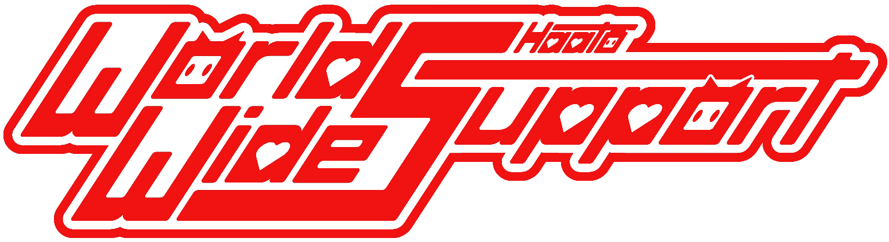

# WWS Haato Fan Group
<link href="src/style.css" rel="stylesheet">
<link href="src/image.css" rel="stylesheet">

<!--language toggle/-->

<section class="header">
  <section class="language_toggle">
    <a href="https://virtualyoutuber.fandom.com/wiki/Akai_Haato">🇯🇵 日本語 </a> 
        | 
    <a href="https://virtualyoutuber.fandom.com/wiki/Akai_Haato">🇺🇸 English </a> 
  </section>

  <element class="button">Current Event</element>
  <element class="button">Previous Works</element>
  <element class="button">Contact</element>

</section>

  

## Current Event
Haachama Birthday Project 2022
  
<!--div class="container" >
  

    
  

  

    <h3>Haachama Birthday Project 2022</h3>
    <h4 style="margin-left:10px">feature 1</h4>  
    <h4 style="margin-left:10px">feature 2</h4>  
    <h4 style="margin-left:10px">feature 3</h4>  
  

</div/-->

  
  

    
tap to join!

  

## About Us

    

World Wide Support for Haato, aka WWS Haato, is a non-profit project team mainly focusing on Haato projects that gather fans around the world. Our team has been set up since March, 2021, when Haato started her long break. ‍ 

We have so far produced our 1st project "World Wide Tour Guide" and 2nd project "Haato's Birthday Parade". We will be continuing to make more supportive projects for Haachama in the future.

## Links 

    

